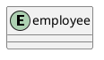

# Design Pattern (GoF)

- 開発者の経験や内的な蓄積としてのパターンを整理したもの
- 開発者に有益で豊かな語彙を与え、互いの意思疎通を容易にする
- オブジェクト指向プラグラミングにおいて、典型的な課題への解放を提供する

## 目次

- [Iterator](#iterator-pattern)

---

## Iterator Pattern

- コレクションの走査処理を抽象化し、一般化したパターン

