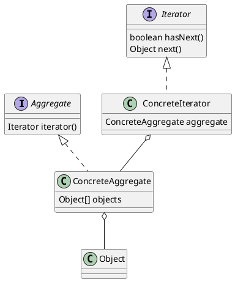
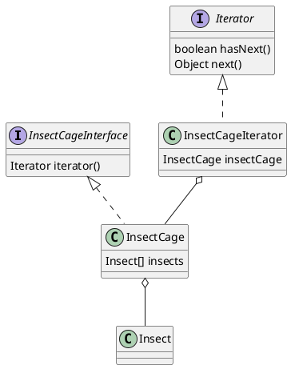

# Design Pattern (GoF)

- 開発者の経験や内的な蓄積としてのパターンを整理したもの
- 開発者に有益で豊かな語彙を与え、互いの意思疎通を容易にする
- オブジェクト指向プラグラミングにおいて、典型的な課題への解放を提供する

## 目次

- [Iterator](#iterator-pattern)

---

## Iterator Pattern

コレクションの走査処理を抽象化し、一般化したパターン



- Iterator
  - 反復子の役
  - 要素を走査していく
- Aggregate
  - 集合体
  - Ieterator(自分が持っている要素を走査してくれる人)を作り出す

### 例

- 虫かご (InsectCage) の中に昆虫 (Insect) を入れ、その虫の名前を順番に表示する



```java
public interface Iterator {
    public abstract boolean hasNext();

    public abstract Object next();
}

/**
 * Aggregate Class
 */
public interface InsectCageInterface {
    public abstract Iterator iterator();

    public abstract Insect getInsectAt(int index);

    public abstract void appendInsect(Insect insect);

    public abstract int getLength();
}

public class Insect {
    private String name;

    public Insect(String name) {
        this.name = name;
    }

    public String getName() {
        return this.name;
    }
}

public class InsectCage implements InsectCageInterface {
    private Insect[] insects;
    private int last = 0;

    public InsectCage(int maxsize) {
        this.insects = new Insect[maxsize];
    }

    public Insect getInsectAt(int index) {
        return this.insects[index];
    }

    public void appendInsect(Insect insect) {
        this.insects[last] = insect;
        last++;
    }

    public int getLength() {
        return last;
    }

    @Override
    public Iterator iterator() {
        return new InsectCageIterator(this);
    }
}

public class InsectCageIterator implements Iterator {
    private InsectCageInterface insectCage;
    private int index;

    public InsectCageIterator(InsectCageInterface insectCage) {
        this.insectCage = insectCage;
        this.index = 0;
    }

    public boolean hasNext() {
        if (this.index < this.insectCage.getLength()) {
            return true;
        } else {
            return false;
        }
    }

    public Object next() {
        Insect insect = this.insectCage.getInsectAt(this.index);
        this.index++;
        return insect;
    }
}

public class Main {
    public static void main(String[] args) {
        InsectCageInterface insectCage = new InsectCage(3);
        insectCage.appendInsect(new Insect("dragonfly"));
        insectCage.appendInsect(new Insect("honeybee"));
        insectCage.appendInsect(new Insect("moth"));

        Iterator it = insectCage.iterator();
        while (it.hasNext()) {
            Insect insect = (Insect) it.next();
            System.out.println(insect.getName());
        }
    }
}
```

#### 新しい要件

- 虫かごを配列から ArrayList にしたい
  - `ArrayList<Insect> insectCages = new ArrayList<Insect>();`
- 変更箇所は`InsectCage`クラスのみ
- **Main は変更しなくて済む**

```java
public class InsectCage implements InsectCageInterface {
    private ArrayList<Insect> insects;

    public InsectCageArrayList(int maxsize) {
        this.insects = new ArrayList<Insect>(maxsize);
    }

    public Insect getInsectAt(int index) {
        return this.insects.get(index);
    }

    public void appendInsect(Insect insect) {
        this.insects.add(insect);
    }

    public int getLength() {
        return this.insects.size();
    }

    @Override
    public Iterator iterator() {
        return new InsectCageIterator(this);
    }
}
```
